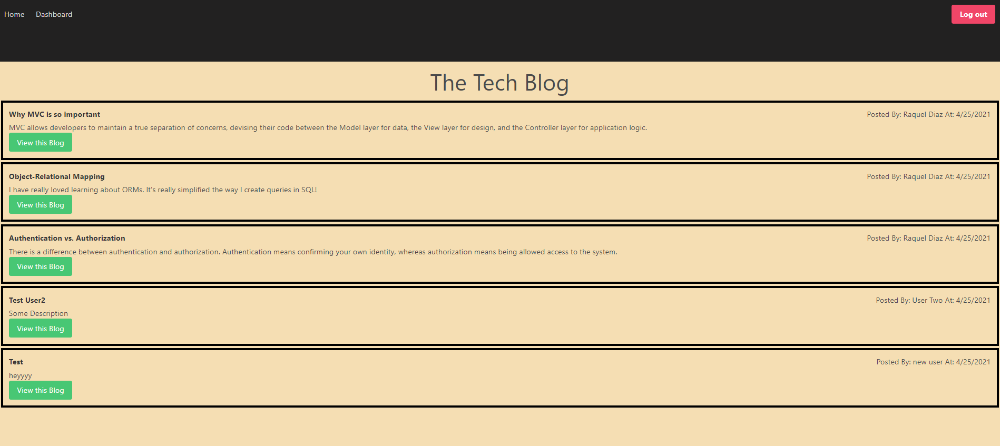

# Tech-Blog
  

  ## Table of Contents 

  1. [Description](#description) 

  2. [Installation](#installation-guidelines) 

  3. [License](#license) 

  4. [Preview](#preview)

  5. [Question](#questions)  

  ## Description 

  An application for developers to publish articles, blog posts, their thoughts, and opinions. You can register, login, create new blog posts, and comment on existing blog posts.
 
  ## Installation guidelines 

  Have node.js installed on your machine. 
  run npm i to install dependencies.

  Required node packages: bcrypt, dotenv, express, connect-session-sequelize,express-handlebars, express-session, mysql12, and sequelize.

  ## License 

  No License 

  ## Preview

  Link to deployed App: https://ancient-reaches-78178.herokuapp.com/

  Preview of Home Page  
  

  ## Questions 
  Email me with additional questions at 
  Rachel7113@gmail.com